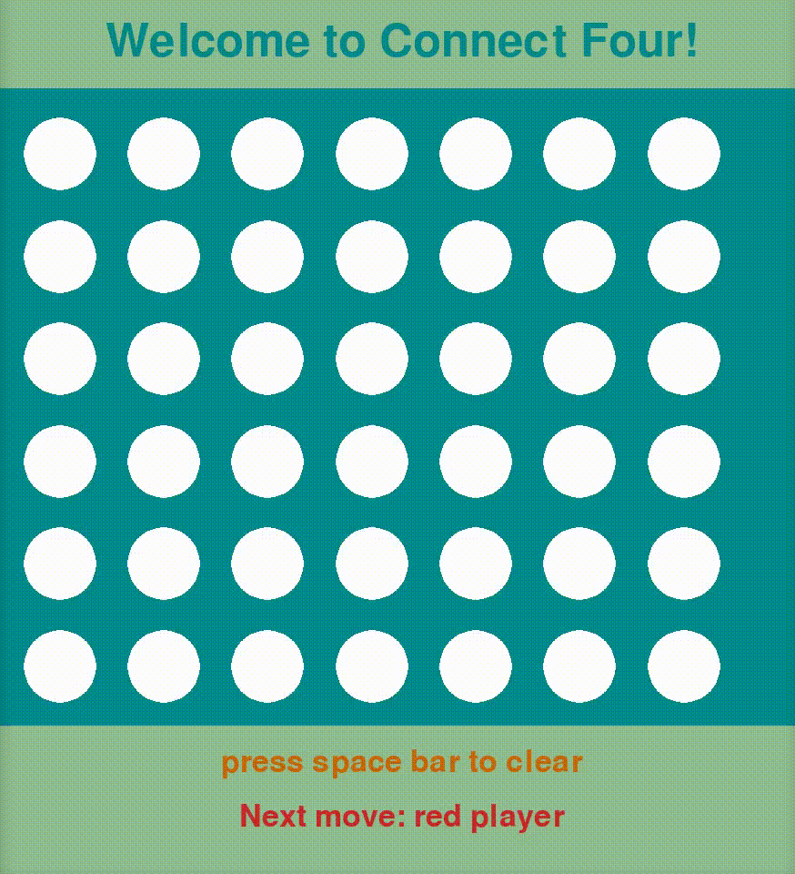

# Connect Four
This is a connect four game in Python3 with a graphical interface.

To start the game, run: $ python3 connect-four.py

You need to have pygame-1.9.6 and python3 installed for this game to work.

See `README.ipynb` for more details.
